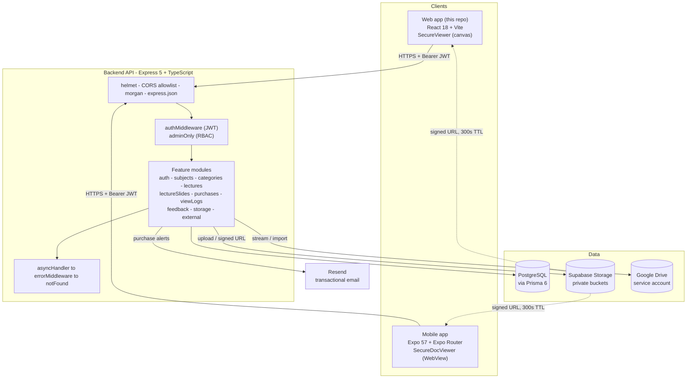
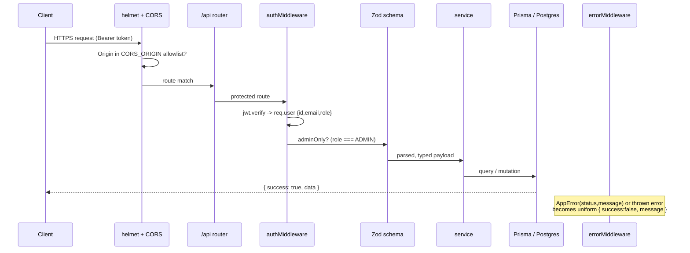
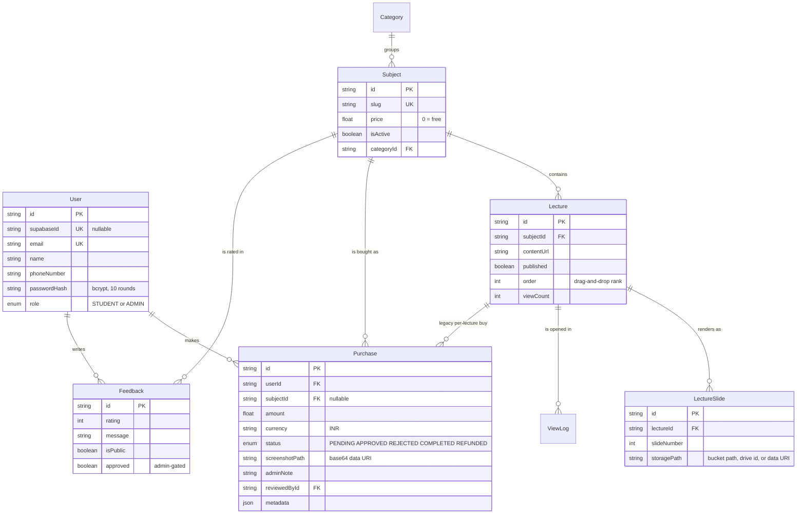
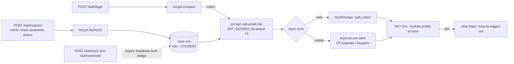
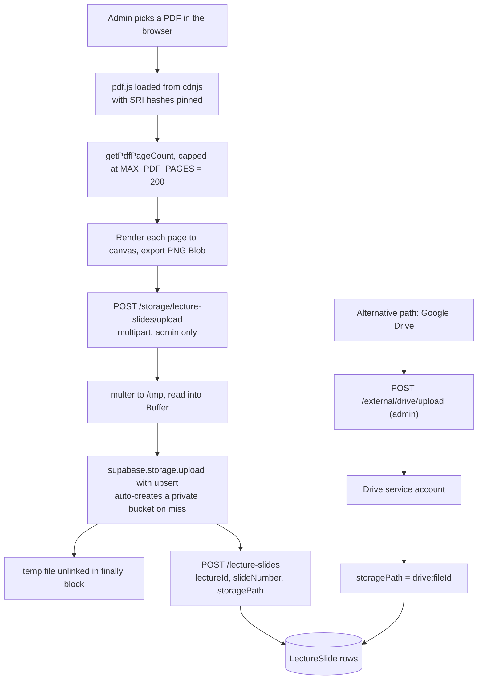
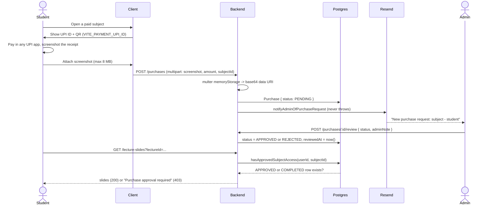
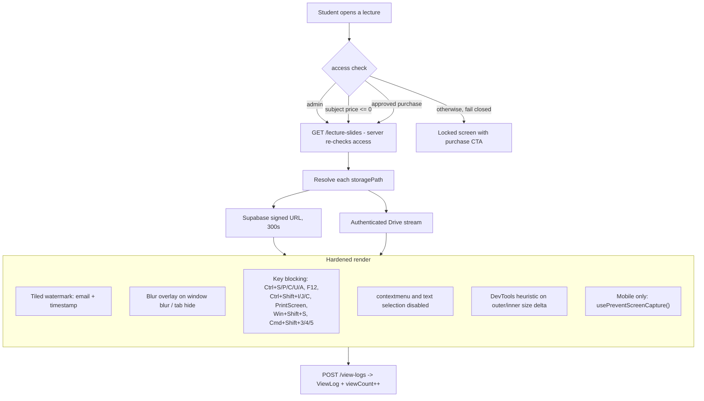

# Secure Study Hub

A secure, purchase-gated lecture delivery platform. Educators upload lecture slides (PDF or images); students buy access to a subject with a UPI payment plus a screenshot as proof, an admin approves it, and the content is then rendered in a hardened viewer that blocks copying, printing, screenshots and offline retention.

**This repository is the web client**, and it also serves as the project's architecture reference. The platform is three separate repositories sharing one Express + PostgreSQL API:

| Component | Repository | Stack | Deployed to |
| --- | --- | --- | --- |
| **Web client** (this repo) | [`secure-study-hub`](https://github.com/rupeshv2121/secure-study-hub) | React 18, Vite 5, TypeScript, Tailwind, shadcn/ui, TanStack Query | Vercel |
| **Backend API** | [`secure-study-hub-backend`](https://github.com/rupeshv2121/secure-study-hub-backend) | Express 5, TypeScript, Prisma 6, PostgreSQL, Zod | Render (primary) / Vercel |
| **Mobile client** | [`secure-study-hub-mobile`](https://github.com/rupeshv2121/secure-study-hub-mobile) | Expo SDK 57, Expo Router, React Native 0.86, NativeWind 4 | EAS Build (Android, iOS) |

File storage runs on **Supabase Storage** (private buckets + short-lived signed URLs) with optional **Google Drive** streaming for large PDFs. Transactional email goes through **Resend**.

---

## Table of contents

**This app**
- [Quick start](#quick-start)
- [Web app structure](#web-app-structure)
- [Environment variables](#environment-variables)
- [Build and deploy](#build-and-deploy)

**Platform reference**
- [System architecture](#system-architecture)
- [Feature matrix](#feature-matrix)
- [Data model](#data-model)
- [Pipelines](#pipelines)
- [Security model](#security-model)
- [API reference](#api-reference)
- [Known gaps](#known-gaps)

---

## Quick start

Requires Node 18+ and a running backend (see the [backend repo](https://github.com/rupeshv2121/secure-study-hub-backend) — default `http://localhost:4000`).

```bash
npm install
cp .env.example .env      # set VITE_API_URL=http://localhost:4000
npm run dev               # http://localhost:5173
```

| Script | Does |
| --- | --- |
| `npm run dev` | Vite dev server with HMR |
| `npm run build` | Production bundle to `dist/` |
| `npm run build:dev` | Development-mode bundle (source maps, no minification) |
| `npm run preview` | Serve the built `dist/` locally |
| `npm run lint` | ESLint across the project |

---

## Web app structure

```
src/
├─ api/
│  ├─ client.ts            # apiFetch: URL building + Bearer token injection
│  └─ auth.ts              # login / register / profile calls
├─ components/
│  ├─ admin/               # AdminStats, AdminCategories, AdminSubjects,
│  │                       # AdminLectures, AdminPurchases, AdminFeedback
│  ├─ ui/                  # 49 shadcn/ui primitives
│  ├─ SecureViewer.tsx     # hardened canvas slide viewer
│  ├─ SubjectCard.tsx  CategoryCard.tsx  LectureCard.tsx
│  ├─ LandingHero.tsx  FeatureGrid.tsx  Testimonials.tsx  FAQSection.tsx
│  └─ FeedbackForm.tsx  FeedbackFab.tsx  Navbar.tsx  SiteLoader.tsx
├─ contexts/AuthContext.tsx  # token storage + profile hydration on boot
├─ hooks/
│  ├─ useSecurityProtection.ts  # key blocking, blur, DevTools heuristic
│  └─ useSubjectAccess.ts       # client-side purchase gating (UX only)
├─ interfaces/             # shared TS types, grouped by consumer
├─ pages/                  # Index, Auth, Subjects, Lectures, Viewer,
│                          # MyPurchases, Profile, Admin, NotFound
├─ integrations/supabase/  # client for the public anon key
└─ utils/pdfToImages.ts    # SRI-pinned pdf.js rasteriser
```

**Routing and code splitting.** All nine routes are `React.lazy` chunks behind a `Suspense` boundary, so heavy dependencies (`recharts` on the admin dashboard, pdf.js on the viewer) only download when their page is visited. A boot loader holds until auth resolves, with a 600 ms floor so it cannot flash. See [`src/App.tsx`](src/App.tsx).

| Route | Page | Access |
| --- | --- | --- |
| `/` | Landing — hero, features, testimonials, FAQ | public |
| `/auth` | Login / register | public |
| `/subjects` | Categories and subjects, with purchase CTA | public |
| `/lectures` | Lectures within a subject | public (metadata) |
| `/viewer/:id` | Secure slide viewer | entitlement-checked |
| `/my-purchases` | Purchase history and status | authenticated |
| `/profile` | Edit name and phone | authenticated |
| `/admin` | Admin dashboard (6 panels) | admin only |

**State.** TanStack Query owns all server state; `AuthContext` is the only global store. There is no Redux.

---

## Environment variables

Every `VITE_*` value is compiled into the browser bundle and is therefore **public** — never put a secret here.

| Variable | Notes |
| --- | --- |
| `VITE_API_URL` | Backend base URL **without** `/api` — [`client.ts`](src/api/client.ts) appends it |
| `VITE_SUPABASE_URL` | Supabase project URL |
| `VITE_SUPABASE_ANON_KEY` | Public anon key only. The service role key belongs on the backend and nowhere else |
| `VITE_PAYMENT_UPI_ID` | UPI ID shown on the payment screen |

Mode-specific files are already wired: `.env.development` and `.env.production` override `.env`.

---

## Build and deploy

Deploy as its own Vercel project with the root directory set to this repository.

| Setting | Value |
| --- | --- |
| Build command | `npm run build` |
| Output directory | `dist` |

[`vercel.json`](vercel.json) supplies three things: an SPA rewrite so React Router routes survive a hard refresh, security headers (HSTS, `X-Content-Type-Options: nosniff`, `X-Frame-Options: SAMEORIGIN`, strict referrer policy, and a Permissions-Policy denying camera/microphone/geolocation), and a one-year immutable cache on `/assets/*`.

> `VITE_API_URL` is **baked in at build time**. Changing it in the Vercel dashboard has no effect until you redeploy — editing repo files alone will not change the production bundle.

---

## System architecture



**Design principles baked into the code**

1. **Single source of truth for authorization.** Slide bytes are never addressable without first passing `GET /api/lecture-slides`, which re-checks purchase state server-side. Client-side gating (`useSubjectAccess`) is UX only.
2. **Fail-closed access checks.** Access is gated on the **subject** price, never the lecture price (lectures default to `0`); an unknown subject price denies access.
3. **Boot-never-crash config.** The backend validates env with Zod but does *not* `process.exit` on failure. It degrades to a best-effort env and reports the offending key names through `GET /api/health`, so a blank serverless env var cannot turn every route into an opaque `FUNCTION_INVOCATION_FAILED`.
4. **Modular vertical slices.** Every backend feature is `*.routes.ts` -> `*.controller.ts` -> `*.service.ts` -> `*.schema.ts` (Zod).
5. **Stateless auth.** No server sessions; a signed JWT (`sub`, `email`, `role`) is the entire auth context — `localStorage` on web, OS keychain on mobile.

### Request lifecycle



---

## Feature matrix

### Students

| Feature | Web | Mobile |
| --- | :-: | :-: |
| Register / login (JWT) | yes | yes |
| Browse categories to subjects to lectures | yes | yes |
| Subject detail with price and purchase state | yes | yes |
| UPI purchase request with screenshot upload | yes | yes (expo-image-picker) |
| Purchase history with PENDING/APPROVED/REJECTED badges | yes | yes |
| Secure lecture viewer (watermark, blur-on-blur, zoom) | yes | yes |
| Landscape viewing / fullscreen | yes (Fullscreen API) | yes (expo-screen-orientation) |
| OS-level screenshot block | best-effort only | yes (expo-screen-capture) |
| Profile edit (name, phone) | yes | yes |
| Feedback / rating submission | yes | not yet |
| Free subjects (price 0) open without purchase | yes | yes |

### Administrators (web only, `/admin`)

| Panel | Capability |
| --- | --- |
| [AdminStats](src/components/admin/AdminStats.tsx) | Totals for users, lectures, categories and views, plus the 10 most recent views |
| [AdminCategories](src/components/admin/AdminCategories.tsx) | Category CRUD (name, description, icon, colour) |
| [AdminSubjects](src/components/admin/AdminSubjects.tsx) | Subject CRUD (price, slug, active flag, category link) |
| [AdminLectures](src/components/admin/AdminLectures.tsx) | Lecture CRUD, drag-and-drop reordering (`@dnd-kit`), publish toggle, slide upload |
| [AdminPurchases](src/components/admin/AdminPurchases.tsx) | Purchase queue: inspect the payment screenshot, approve or reject with a note |
| [AdminFeedback](src/components/admin/AdminFeedback.tsx) | Approve feedback for public display as testimonials |

---

## Data model



`Purchase` also carries a self-referencing reviewer link (`reviewedById` to `User`) recording which admin actioned the request.

Canonical schema: [prisma/schema.prisma](https://github.com/rupeshv2121/secure-study-hub-backend/blob/main/prisma/schema.prisma) (14 migrations applied).

**`storagePath` is polymorphic** and the viewers branch on its shape:

| Shape | Resolution |
| --- | --- |
| `lectures/<id>/slide-3.png` | Supabase bucket path, resolved via `GET /api/storage/lecture-slides/signed-url` (300s TTL) |
| `drive:<fileId>` | Streamed through `GET /api/external/drive/:id/stream` with the caller's JWT |
| `https://...` or `data:...` | Used verbatim |

---

## Pipelines

### 1. Authentication



Both clients hydrate identically: read the stored token, call `GET /me`, and on any failure discard the token and fall back to logged out. Role comes from the JWT claim and is re-verified server-side by `adminOnly` on every privileged call — the client's `user.role` only decides what UI to draw.

### 2. Content ingestion (admin-authored)



PDF rasterisation happens **in this app, client-side** ([`src/utils/pdfToImages.ts`](src/utils/pdfToImages.ts)), so the server never needs a PDF toolchain — which is what keeps the API deployable to a serverless runtime. The trade-off is browser memory, hence the 200-page cap.

### 3. Purchase and approval



**State reduction rule**: a subject's state is the maximum over its purchase rows, so approval always wins and a later rejected resubmission can never revoke access already granted. `APPROVED` and `COMPLETED` grant access; `PENDING`, `REJECTED` and `REFUNDED` do not.

### 4. Secure viewing



[`SecureViewer.tsx`](src/components/SecureViewer.tsx) paints slides to a `<canvas>` rather than an `` a user could right-click and save, with zoom, prev/next and fullscreen. The [mobile viewer](https://github.com/rupeshv2121/secure-study-hub-mobile/blob/main/src/components/SecureDocViewer.tsx) renders a whole lecture into one continuously scrolling WebView and adds a real OS-level screenshot block — the one guarantee this web client cannot make.

---

## Security model

| Layer | Control | Where |
| --- | --- | --- |
| Transport | HSTS, `nosniff`, `SAMEORIGIN`, strict referrer, locked-down Permissions-Policy | [vercel.json](vercel.json) |
| Transport | Helmet defaults with `crossOriginResourcePolicy: cross-origin` | backend `app.ts` |
| Origin | Explicit CORS allowlist from `CORS_ORIGIN`; requests with no `Origin` (native mobile) pass | backend `app.ts` |
| Identity | bcrypt (10 rounds), JWT HS256, `JWT_SECRET` of at least 16 chars enforced by Zod | backend `auth.service.ts` |
| Token storage | `localStorage` on web, OS keychain via `expo-secure-store` on mobile | [AuthContext.tsx](src/contexts/AuthContext.tsx) |
| Authorization | `authMiddleware` + `adminOnly` on every mutating route; controllers re-assert role | backend `auth.middleware.ts` |
| Entitlement | `hasApprovedSubjectAccess` on the slide-list endpoint, subject-level and fail-closed | backend `purchase.service.ts` |
| Content at rest | Private Supabase buckets, never public | backend `storage.service.ts` |
| Content in transit | Signed URLs, 300-second TTL, minted per request | backend `storage.service.ts` |
| Path safety | `normalizeStoragePath` rejects `..`, absolute and bucket-escaping paths | backend `storage.service.ts` |
| Input | Zod schemas per module; parse failures surface as 400 | backend `*.schema.ts` |
| Uploads | 8 MB cap on purchase screenshots; temp files unlinked in `finally` | backend `purchase.routes.ts` |
| Supply chain | pdf.js pinned to 3.11.174 with SRI hashes on both script and worker | [pdfToImages.ts](src/utils/pdfToImages.ts) |
| Client hardening | Watermark, blur-on-blur, key blocking, DevTools heuristic | [useSecurityProtection.ts](src/hooks/useSecurityProtection.ts) |

> **Threat-model honesty.** The web protections (key blocking, blur, DevTools detection) raise the cost of casual copying; they are **not** a defence against a determined user with a camera, a second device, or a patched browser. The only hard controls are server-side: purchase verification before slide URLs are ever minted, private buckets, and 5-minute signed URLs. The mobile client is meaningfully stronger because `expo-screen-capture` is enforced by the OS.

---

## API reference

Base URL `<host>/api`. All responses use the envelope `{ success, data | message }`. Auth is `Authorization: Bearer <jwt>`. Implementation lives in the [backend repo](https://github.com/rupeshv2121/secure-study-hub-backend).

**Legend** — `pub` public, `auth` authenticated, `admin` admin only.

| Method | Endpoint | Auth | Purpose |
| --- | --- | :-: | --- |
| GET | `/health` | pub | Liveness; returns 500 with `envIssues` when config is invalid |
| POST | `/auth/register` | pub | Create account, returns `{ user, token }` |
| POST | `/auth/login` | pub | Exchange credentials for a JWT |
| POST | `/auth/sync` | pub | Upsert a user from Supabase Auth (legacy bridge) |
| POST | `/auth/webhook` | pub | Supabase user-created webhook target |
| GET | `/me` | auth | Current profile, read from the database |
| PUT | `/me` | auth | Update name / phone |
| GET | `/categories`, `/categories/:id` | pub | List / read categories |
| POST, PUT, DELETE | `/categories`, `/categories/:id` | admin | Category CRUD |
| GET | `/subjects`, `/subjects/:id` | pub | List / read subjects |
| POST, PUT, DELETE | `/subjects`, `/subjects/:id` | admin | Subject CRUD |
| GET | `/lectures`, `/lectures/:id` | pub | List / read lectures (metadata only) |
| POST, PUT, DELETE | `/lectures`, `/lectures/:id` | admin | Lecture CRUD, ordering, publish flag |
| GET | `/lecture-slides?lectureId=` | auth | **Entitlement-checked** slide list |
| POST | `/lecture-slides` | admin | Attach a slide to a lecture |
| DELETE | `/lecture-slides/:id` | admin | Remove a slide |
| POST | `/purchases` | auth | Submit a purchase request (multipart, field `screenshot`) |
| GET | `/purchases` | auth | Own purchases; all purchases when admin |
| GET | `/purchases/:id` | auth | Purchase detail |
| POST | `/purchases/:id/review` | admin | Approve / reject with an admin note |
| POST | `/view-logs` | auth | Record a lecture view |
| GET | `/feedbacks/public` | pub | Approved public testimonials |
| POST | `/feedbacks` | pub | Submit feedback (auth optional) |
| GET | `/feedbacks` | admin | All feedback for moderation |
| PUT | `/feedbacks/:id/approve` | admin | Publish a testimonial |
| POST | `/storage/:bucket/upload` | admin | Upload a file (multipart, field `file`) |
| POST | `/storage/:bucket/remove` | admin | Delete objects |
| GET | `/storage/:bucket/signed-url?path=` | auth | Mint a 300s signed URL |
| GET | `/storage/:bucket/exists` | auth | Debug: does an object exist |
| GET | `/external/drive/:id/stream` | auth | Proxy-stream a Drive file |
| POST | `/external/drive/:id/import` | admin | Copy a Drive file into a bucket |
| POST | `/external/drive/upload` | admin | Upload straight to Drive |
| GET | `/external/drive/:id/meta`, `/debug`, `/external/test` | pub | **development only** Drive diagnostics |
| GET | `/admin/stats` | admin | Totals plus the 10 most recent views |

---

## Known gaps

Tracked here so nobody rediscovers them the hard way:

- **No automated tests** in any of the three repositories.
- **Purchase screenshots are stored as base64 data URIs** in the `Purchase.screenshotPath` column rather than in object storage. Simple and self-contained, but it inflates row size and the payload of every purchase list query.
- **No rate limiting** on `/auth/login` or `/auth/register`.
- **`/auth/webhook` is unauthenticated** even though `SUPABASE_WEBHOOK_SECRET` exists in the backend config schema; the secret is not yet verified in the handler.
- **The Supabase-Auth bridge is a dual path.** Password auth in Postgres is the live system; `/auth/sync`, `/auth/webhook` and the backend's `supabase/migrations/` directory are leftovers from the earlier Supabase-RLS architecture.
- **Feedback is web-only**; there is no mobile surface for it yet.
